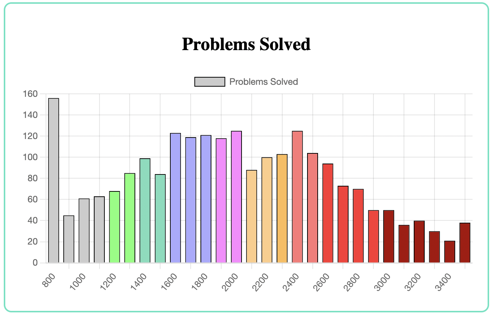
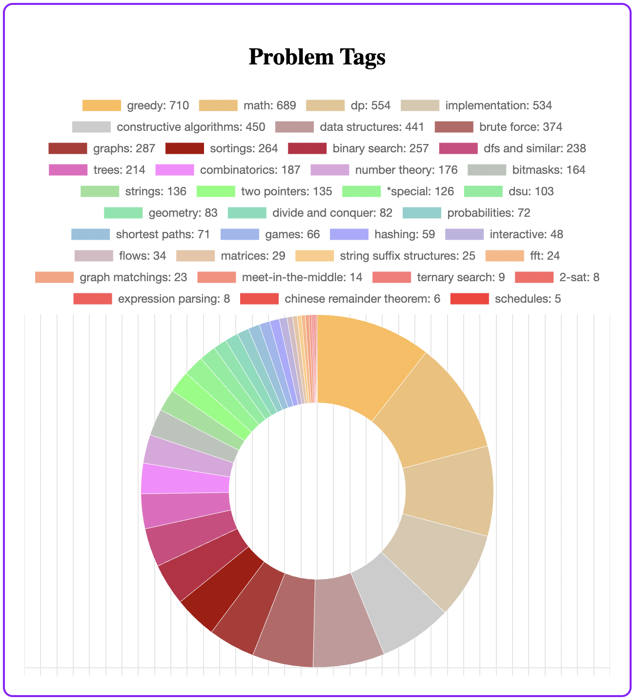

# Codeforces Analytics

This project aims to write a Codeforces Chrome extension which can be used for various analytics tasks.

## Tech Stack Used

- [React](https://react.dev/) 
- [Chart.js](https://www.chartjs.org/)
- [Codeforces APIs](https://codeforces.com/apiHelp)

### Follow [Sanchit Singla | Github](https://github.com/sanchit324)

